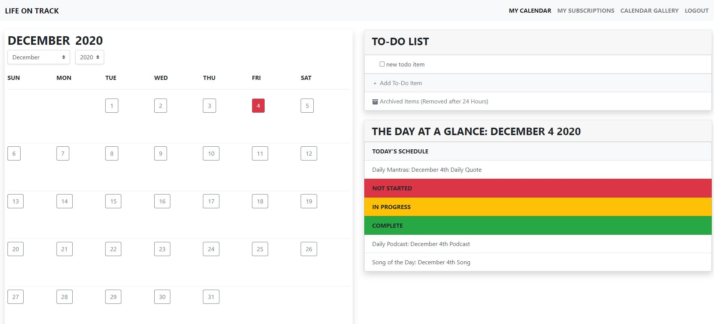

# Zeta
## Life On Track
Fall Semester 2020

### Overview  
---
*Link to application:* https://life-on-track.herokuapp.com/

Our web application is called "Life On Track" and is a scheduling app geared towards teachers and students but has full capabilities to be used for daily planning purposes and everyday use. "Life on Track" allows you to create shareable "calendars" that allow you to create action items or events to share with yourself and others. It also provides you with your own personal calendar that you can customize to include the information that pertains the most to you. 

This is where "Life On Track" stands out from other scheduling web apps. With many platforms like Google Calendars, Apple Calendars, etc., most of the time if you edit an item on your calendar, if others are associated with this event, they will get these updates. "Life On Track" allows you to pick and choose the updates that pertain the most to you. It also allows you to add those events or items to your personal calendar and customize them to your liking without affecting other users' personal items. 

Each calendar you create in the Calendar Gallery places you as an admin of that particular calendar and you have the ability to customize these calendars under "Subscriptions" as well. This is where your subscribers will see your admin updates and will have the ability to pull in the changes or not - whichever they may choose. 

Another aspect that sets "Life On Track" apart is the To-Do List feature on your Personal Calendar page. This option has been provided to allow the user to maintain productivity and create small quick lists with the option to archive items based on how they see fit. 

The "Life On Track" admins have also provided you with a few curated calendars you may choose to subscribe to in order to allow you to expand and explore new interests. We have worked to put together four premade calendars that will change and be updated monthly - "Song of the Day", "Daily Mantra", "Daily Podcast", and "Daily Updates". These calendars are available to you and you can add them to your personal as you see fit. This gives you the opportunity to expand your horizons or check out some new interests.

"Life On Track" is a uniquely customizable calendar and productivity app that helps you to track you own actions and events in the way that is most helpful to you, combining the best of collaborative calendars with the strengths of a personal calendar.

### Team Members  
---
Britney Bourassa, git alias: bbourassa  
Meghan Arnold, git alias: arnol24m  
Sara Whitlock, git alias: nimwhit  
### User Interface  
---
The User Interface is broken into three main sections - Personal Calendar, Subscriptions, and Calendar Gallery. 

#### Personal Calendar
The personal calendar is the section of the user interface that holds your completely personalized items. These are items or events that you have added to your calendar from the Subscriptions page. Here is where you can edit and customize these items to your liking as well as track your progress by switching the status. The action items you have are set to their status when you click on a day from the calendar. The events are simply under today's schedule. The calendar on the left shows days that have items on them outlined in grey. The current day is in red and is the default "Day at a Glance" view. The personal calendar interface also has a "To-Do" list that allows you to create quick to-dos for yourself. Checking off the to-dos archives them for 24 hours so that on the off chance that something is archived before it is meant to be, it can be recovered for up to 24 hours.

#### Subscriptions
The subscriptions page interface is where your calendars - both created and subscribed - are stored in table form. This provides a list of all action items and events that have been added by the owner and allow for users to pick and choose what they want to add from the overall calendar to be added to their personal calendar. The settings portion on the right side of the page are different depending on whether or not you are an "Admin" or owner of a calendar. You know which calendars you are an "Admin" of by looking at the subscriptions navigation pane which lists "- ADMIN" next to the calendar names you own.

##### Subscriptions - Subscriber View
When you are a "subscriber" to the calendar you have the ability to add selected items, add all action items, or add events to your personal calendar. You can also select items that have been updated by the owner and apply those updates to the events and action items on your personal. It is important to note that the current implementation is that updating an item on your personal will replace any edits you have made with the owner's updates. This is the current implementation as there are many user cases where this could be helpful. 

##### Subscriptions - Admin View
When you are an "admin" of a calendar your settings change. As an admin, you have an edit capability on the table that allows you to update items as you see fit and will provide your subscribers with those updates. You are also able to add items to the table on your subscription page. You have two deletion capabilities - you can delete selected items or choose to delete your whole calendar which would then delete it for your subscribers as well. You also are able to generate a letter code for your calendar on this page to share with other users to allow them to subscribe to your calendar.

#### Calendar Gallery
The calendar gallery is where calendar creation and subscription happen. The first section contains the admin curated calendars that are free for you to subscribe to. Hitting "Add Calendar" redirects you to your Subscriptions page and places you on the calendar you just added. These calendars are monthly calendars that will be updated by the admins for each month. The second portion allows you to create your own calendar. You simply enter the name of your calendar and hit the "Create New Calendar" button and will be redirected to the Subscriptions page under your new calendar. The third portion allows you to subscribe to another user's calendar using a code they give you. All codes are case sensitive and must be lowercase. You enter your code and hit "Subscribe to Calendar" to be redirected to the subscriptions page under your newly subscribed calendar. You cannot subscribe to a calendar more than once.  

#### Login/Sign Up
Login and sign-up interfaces are very generic. To sign up you give your first and last name, an email, and create a username and password. You are required to confirm your password. Your information is used to connect you up to your personal calendar and subscriptions/created calendars. Your username and password are also used on the login page to log you in as you would normally do on any other website.

### API  
---
All API endpoints are located in server/app.js
#### API Endpoints Associated With To-Dos:
- *GET: /api/todos/:user*  
  - This call gets all of the user's todo items associated with their user id.  
- *POST: /api/todos/:user*  
  - This call creates a new todo item for a user associated with their user id.  
- *PUT: /api/todos/:user/:todo*  
  - This call edits a user's todo item. Todo items are only edited on archive/unarchive and only the time of archive can be updated. The item is found by matching the user's id and the todo item's id.  
- *DELETE: /api/todos/:user/:todo*  
   - This call deletes a user's todo item which is only done 24 hours after archive. It finds the  
      correct todo item by the todo item's id and the user's id and deletes that item.  

#### API Endpoints Associated With Subscriptions:
- *POST: /api/subscriptions/:user*  
  - This call creates a new calendar subscription for the user and associates their user id with the calendar id that is given through the request body.  
- *USE: /api/subscriptions/:user*  
  - This call lists all of a user's subscriptions by finding all subscriptions using their id. This is then used to find the appropriate calendars on the subscription page. Calendar APIs are described below.  
- *GET: /api/subscriptionlist/:cal*  
  - This call gets all of the subscriptions associated with a particular calendar id.  
- *DELETE: /api/subscriptions/:sub*  
  - This call deletes a subscription by locating it based on its subscription id.  

#### API Endpoints Associated With Calendars:  
- *GET: /api/cals*  
  - This call lists all available calendars.  
- *GET: /api/cals/:user/all*  
  - This call gets all of a user's calendars by finding the calendar's that have the user's id as their owner id.  
- *POST: /api/cals/:user*  
  - This call creates a new calendar based on the given information and sets the user's id to be the calendar's owner id.  
- *GET: /api/cals/:cal/*  
  - This call finds a specific calendar by searching for it by its id.  
- *PUT: /api/cals/:cal*  
  - This call allows for a calendar to be edited by locating it by its id.  
- *DELETE: /api/cals/:cal*  
  - This call deletes a calendar by locating it by its id and removing it.  

#### API Endpoints Associated With Items:
- *GET: /api/items/:cal*  
  - This call gets all items on a particular calendar by locating them by the calendar id and lists all the items.  
- *POST: /api/items/:cal*  
  - This call creates a new item for a calendar by adding the item based on the user generated info the associated calendar id.  
- *GET: /api/items/:cal/:item*  
  - This call finds a specific item by locating it based on its calendar id and its item id.  
- *GET: /api/item/:item*  
  - This call finds a specific item by its item id.  
- *PUT: /api/items/:cal/:item*  
  - This call locates an item based on its calendar id and its item id and edits it based on the new information provided.  
- *DELTE: /api/items/:cal/:item*  
  - This call removes an item by locating it based on its calendar id and item id and deleting it.   
  
#### API Endpoints Associated with Authentication:
- *GET: /user*
  - This call checks that a user is logged in, and if so, puts the user's username in the response.
- *POST: /login*  
  - This call submits the values in the login form for authentication. If authentication is successful, the user will be routed to their personal calendar. If not, the form will be cleared for another attempt.
- *POST: /logout*
  - This call logs the user out by removing them from the current session.  
- *POST: /signup*
  - This call submits the values in the account sign up form, creating a new user. Upon creation, the user is routed to the login form.  

### Database  
---  
Our database was created with Postges.

#### Users table
| Column| Data Type| Description|
|---|---|---|
| id| Integer Primary Key  | Identifying number used as reference |
| username| Varchar| Name the users logs in with|
| firstname| Varchar| First name the user registered with  |
| lastname| Varchar| Last name the user registered with   |
| email| Varchar| Email the user registered with       |
| calendar_id| Integer Unique| Id for the user's personal calendar  |
| salt| Varchar| Salt code associated with the user's password |
| hash| Varchar| Hash code associated with the user's password  |

#### Todos Table
| Column| Data Type | Description |
|---|---|---|
| id | Integer Primary Key  | Id used as ref. for todo item |
| content | Varchar | Content of the todo item |
| user_id | Integer | User that the todo item belongs to |
| archived | Integer | Indicator of whether item has been archived |
| time_of_archive | Varchar | Time that the item was archived, if applicable |

#### Subscriptions table
| Column| Data Type | Description |
|---|---|---|
| id | Integer Primary Key  | Identifying number used as reference |
| user_id | Integer | User that is subscribed to given cal |
| calendar_id | Integer | Id of calendar user s subscribed to  |

#### Items table
| Column | Data Type | Description |
|---|---|---|
| id | Integer Primary Key  | Id used as ref. to item |
| name | Varchar | Name of the item |
| item_type | Integer | Item is either 1=action item or 2=event |
| start_time | Varchar | Time at which an event starts or an action is due |
| end_time | Varchar | Time at which the event should end |
| description | Text | Description listed in the item |
| item_status | Integer | 0= no status(event),  1= not started, 2= in progress, 3= completed |
| calendar_id | Integer | Calendar that the item is on |
| related_links | TEXT | Links that are related to this item |
| parent_id | Integer | Id of the calendar this item came from. Used to fetch updates to an item already on personal calendar |

#### Calendars table
| Column| Data Type| Description|
|---|---|---|
| id | Integer Primary Key  | Id used as ref. to calendar |
| name | Varchar | Name of the calendar |
| owner_id | Integer | User id of the user that created the cal |
| personal | Integer | Whether the calendar is a personal cal; 1= personal |
| description | Text | Description of the calendar |

### URL Routes/Mappings  
---
- *https://life-on-track.herokuapp.com/html/index.html*
    - This is the main login page and is where users login with their credentials. On a successful login it redirects to your personal calendar.
    - This page is also accessed when a user hits "Logout" on the navigation bar.
- *https://life-on-track.herokuapp.com/html/signup.html*
    - This is the page where users sign up to use "Life On Track" - On sign-up it redirects to the login page.
    - It is accessed on the "Sign Up" part of the navigation bar.
- *https://life-on-track.herokuapp.com/html/personalcal.html*
    - This is the page used to access a user's personal calendar. 
    - It is accessed by clicking on "My Calendar" in the navigation bar.
    - This page is only accessed by authenticated users.
- *https://life-on-track.herokuapp.com/html/subscriptions.html*
    - This is the page used to allow the user to access their subscriptions. 
    - It is accessed by clicking on "My Subscriptions" in the navigation bar.
    - It is also accessed when a user clicks "Add Calendar", "Create New Calendar" or "Subscribe to Calendar" on the "Calendar Gallery" page.
    - This page is only accessed by authenticated users.
- *https://life-on-track.herokuapp.com/html/calgallery.html*
    - This is the page used to allow users to subscribe to premade admin calendars, premade calendars by other users, or create their own calendar.
    - It is accessed by clicking on "Calendar Gallery" in the navigation bar.
    - This page is only accessed by authenticated users.
    
### Authentication/Authorization  
---
Life On Track uses Passport and Express-Session to manage the authentication of users. It also uses an encryption program, as provided in class. Upon user registration, the User has a username and user id associated with their account for identification. The user's password is encrypted in a salt and hash and stored within our database. 

Upon login, the user has immediate access to a personal calendar. This calendar cannot be accessed by any other user, as it is not sharable, and the user is the only individual that can ever be the administrator of it. This calendar is viewed through the personal calendar page; upon login, the user is routed to this view.

The calendars which the user has subscriptions to fall into two different categories. The user can be the creator, and therefor administrator, of a calendar; or they can be a subscriber. If the user is only a subscriber to a calendar, the settings on the right hand side of the subscriptions page includes the ability to add items to from the subscription to their personal calendar, as well as to update those items. If the user is the admin of a calendar, they have an additional set of settings. The administrator settings allow the user to create, edit, and delete items from the calendar. It also allows the user to delete the calendar entirely, and to access the sharable code for that calendar.

### Division of Labor  
---
**Britney Bourassa** -- Personal Calendar creation, user interface, and implementation; front-end of login and sign up; Database set up and implementation; API functionality; Pre-made calendars; Debugging; documentation  
**Meghan Arnold** -- Subscriptions creation, user interface, and implementation; Item creation; back-end of login authentication; Database set up; API functionality; Pre-made calendars; Debugging; Documentation  
**Sara Whitlock** -- API stubs; API functionality; Fake data generation

### Conclusion  
---
Our team had a very bumpy road to completion, but we pulled through and made an application that we are proud of.  

Some technical difficulties that we ran into were related to authentication. The authentication was difficult to implement and took a long time to resolve. Due to the authentication issues, some of the routing of pages did not work as intended. Instead of a given page that required an authenticated user checking for a user on the route, and immediately redirecting back to login, we had to implement it so that the page would check authentication on load. While this is clearly not best practice, it does not result in any data leaking. We decided that for the purposes of this project, it was a sufficient solution, specifically because this and the rest of authentication took an entire week to resolve.  

We learned a great deal from this project. We found that aside from the technical pieces that we learned—of which there were many—we learned a lot about the web design process overall. We found that planning was essential to getting started and structuring out work, but that the development process was extremely dynamic. Some of our anticipated back end structure changed drastically throughout the process.  

Another aspect that we learned along the way was the importance of testing. Throughout the first two milestones, we found that frequent, repeated testing was necessary. We found many instances where a bug did not crop up until the second or third repetition. Additionally, we found that having users beta-test the site was extremely helpful. We realized that, as the programmers, we had a different way of looking at the site—a blind spot. Having users test the application made it possible to find and examine those spots that we were missing. The individuals who helped us to test were responsible for finding many bugs, and they pointed out many additional features that could be explored in the future.  

One thing that it may have been helpful to know going into the project was how much the application could change, and that the major changes what we needed to make were acceptable. It may also have been helpful to have a checklist of what was due for each milestone. The documents for the assignment were amazingly detailed and immensely helpful, and a checklist may have made things clearer. It would also have been helpful to receive a breakdown of the relative importance of each aspect of a given milestone.  

We had a bumpy ride, but we put in a lot of time and effort, and we are proud of the outcome. It was difficult, but we both enjoyed it, and we are considering continuing to expand and improve upon it in the future!
