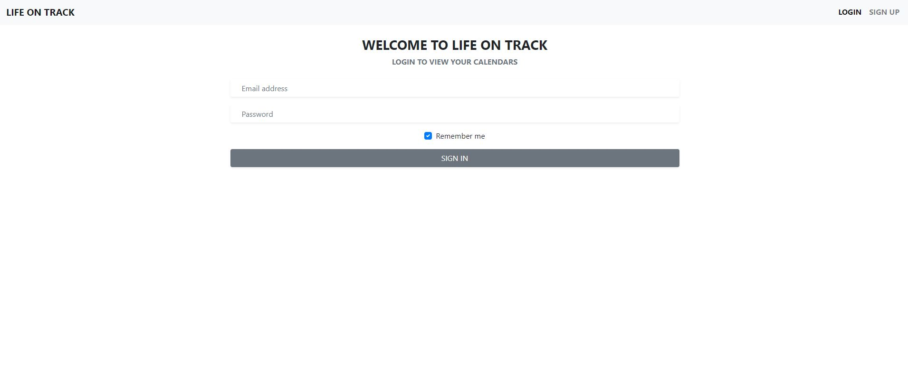
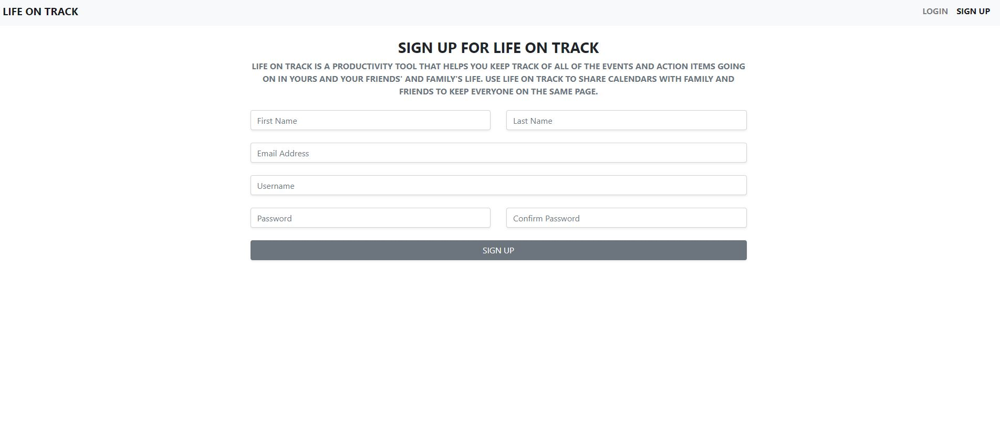
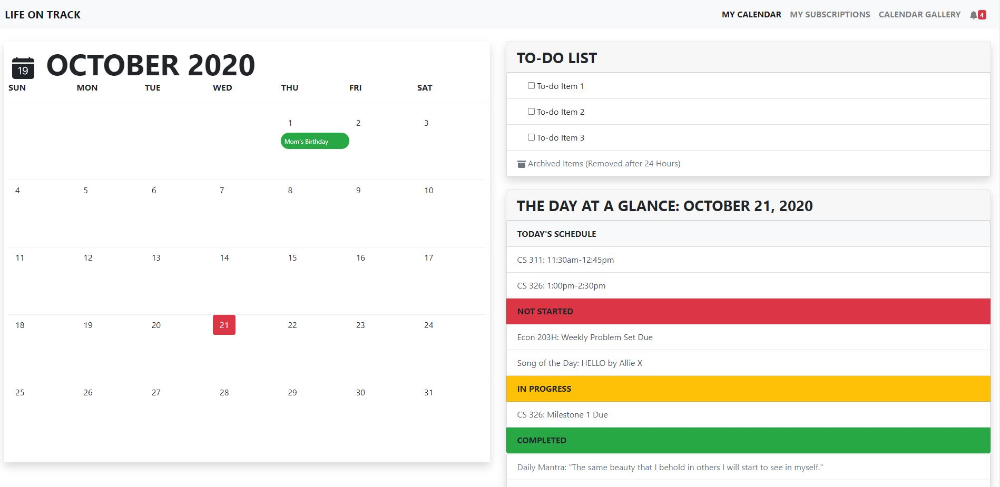
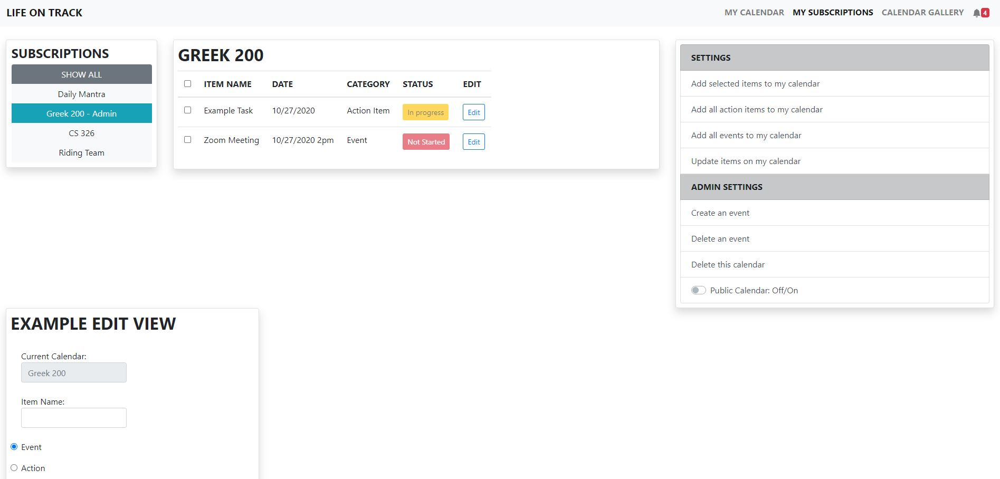

<title>Team Zeta</title>
<h1>Milestone 1</h1>

<h2>Data Interactions<h2>

The user will be able to save their own calendar, access public calendars, and accessed private, shared calendars. Information saved will include the event date/time, a description about it, and completion status.

<h2>Wireframes<h2>

Login View

Sign Up View

Personal Calendar View

Subscriptions View

Subscriptions Edit View

Calendar Gallery View

Login View

Sign Up View

Personal Calendar View

Subscriptions View

Calendar Gallery View

<h2>Screenshots</h2>

<h2>Divsision of Labor<h2>
<ul>
    <li>Britney Bourassa: Personal calendar page, Calendar Gallery, Milestone 1 .md file</li>
    <li>Meghan Arnold: Subscriptions page, Milestone 1 .md file</li>
    <li>Sara Whitlock: N/A, unable to contact</li>
</ul>