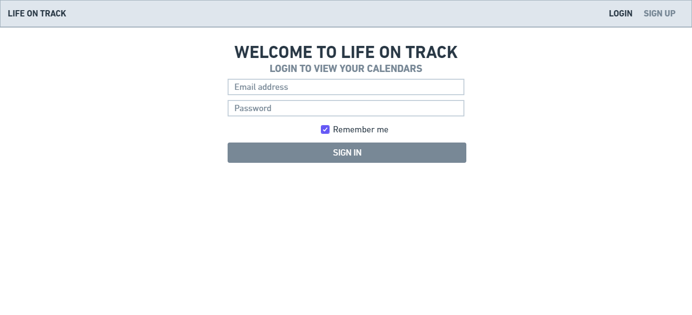
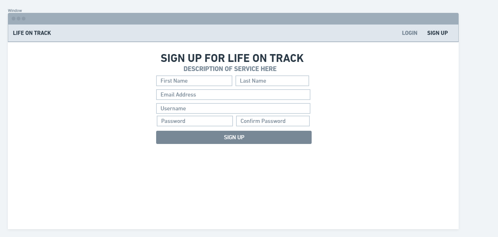
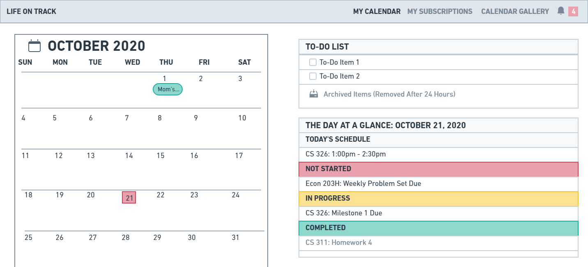
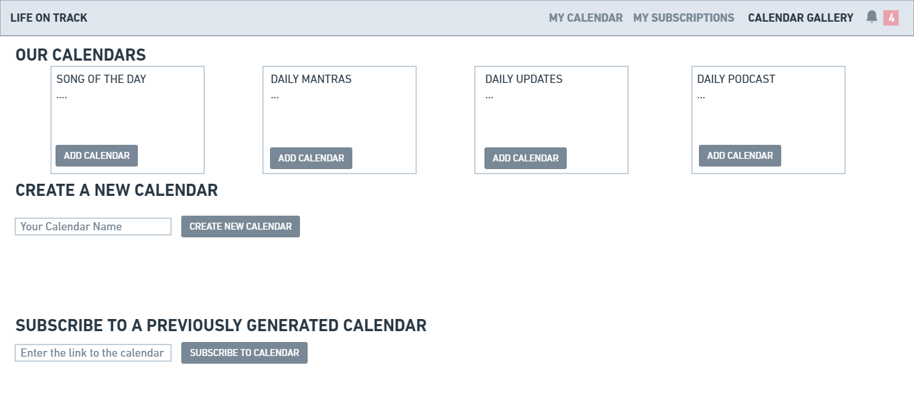

<h1>Team Zeta: Milestone 1</h1>

<h2>Data Interactions<h2>

The user will be able to save their own calendar, access public calendars, and accessed private, shared calendars. Information saved will include the event date/time, a description about it, and completion status. The idea is that users can customize their personal calendars to reflect the items that they take from the calendars they create along with other users' previously generated calendar. They are also provided the option to use a premade calendar by us - there are four: song of the day, daily podcast, daily news, and daily mantra - which allows them to add something fun they want to pick up daily and gives them something new to look forward to viewing. All of these items will be added via links so that the user can navigate straight to the source of the item. For items on calendars, the ability to add relevant information will also include link sharing to any important links or documents that may be necessary. The generation of a public calendar will also be done by creating a link to the calendar that can be shared with others. This is how you can access your family and friends' calendars.

<h2>Wireframes<h2>

Login View

    
This is the main login page for "Life on Track." It looks similar to any other login page you may have seen but is necessary to account for unique users.

Sign Up View

    
The sign-up page for "Life on Track" is where you can go to open an account. You create a username and password. Mostly, the username is important since this is what will be associated with any public calendar you create so others know who is an admin of a calendar.

Personal Calendar View

    
The personal calendar view is essentially the home page for "Life on Track." This is where any events you have pulled onto your personal calendar will be. You add events and delete events to this calendar on the "My Subscriptions" page which is discussed below. The to-do list is customizable from the user and has no relation to events on the calendar - this is a space for you to customize the subtasks you want to complete in a day. To-do items marked complete get moved to the archive folder which will hold them for 24 hours and then will refresh. At any point during that time period, you can view archived items and restore them if need-be. Initially, your "Day at a Glance" pannel will always be related to the current day on page load. However, the calendar itself is made up of buttons for each date so you can view ahead and behind your current date (for the sake of scope, this is limited to one month). Your items are categorized by their current status - Not Started, In Progress, and Completed - and any events are listed under "Today's Schedule". If an event is an ongoing event for the whole day, then it shows up on the calendar as demonstrated on the October 1st date. These items will ideally be clickable and will generate a popup similar to what is shown in "Subscriptions Edit View" section and allow you to set your status or change anything LOCALLY. This means that anything you do to your PERSONAL calendar will not effect items on the created calendar under Subscriptions.

Subscriptions View

    
The Subscriptions page is where all calendars you are subscribed to lie. This includes the ones that you have created as well which is indicated by the Admin label. Here we have demonstrated the highest level of settings on a calendar which is the admin option. The settings themselves are self explanatory.

Subscriptions Edit View

    
As an admin, you can edit any of the events on the main calendar in subscriptions and these changes are then visible to your subscribers. This is where the notification bell comes in. Notifications indicate there are updates on the calendar. The hope is to add a pannel that demonstrates recent updates. Admins will be required to confirm their updates with a message which is what a user will see listed under their updates for that calendar. The edit pannel shown is an idea of what will be used across the web app. The idea is that the only difference will be if the changes to the event are made by the admin, an update message will be sent to all users.

Calendar Gallery View

    
Calendar Gallery allows you to subscribe to one of our calendars, create a new calendar, or subscribe to one. The page itself is mostly self-explanatory. For our previous calendars, you simply hit "ADD CALENDAR" which will redirect you to the new calendar in "My Subscriptions." For generating a new calendar, you give your calendar a new name and hit the button and are redirected to "My Subscriptions" where you will have a new calendar with admin settings and an example action item and event in your table for reference. Subscriptions are done by pasting the link of an already made calendar by a user into the input and the button also redirects to that particular calendar on your subscriptions page.

Login View

Sign Up View

Personal Calendar View

Subscriptions View

Calendar Gallery View

<h2>Screenshots</h2>

<h2>Divsision of Labor<h2>
<ul>
    <li>Britney Bourassa: Personal calendar page, Calendar Gallery, Milestone 1 .md file</li>
    <li>Meghan Arnold: Subscriptions page, Milestone 1 .md file</li>
    <li>Sara Whitlock: N/A, unable to contact</li>
</ul>
