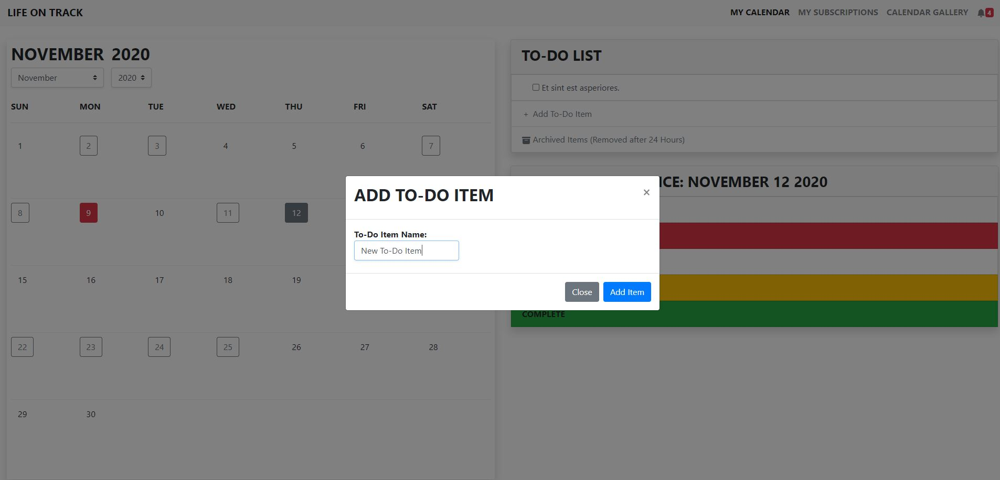
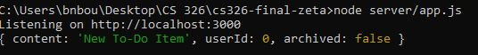
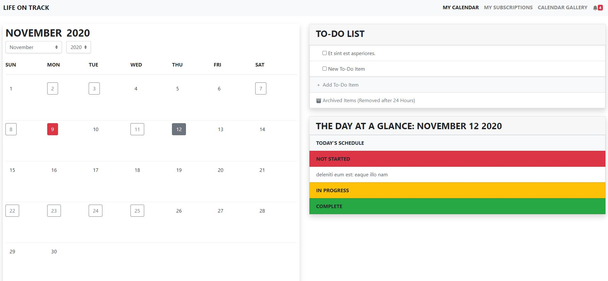
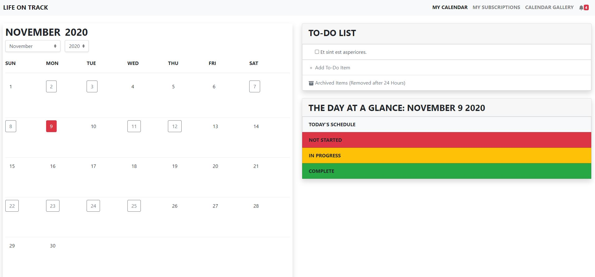
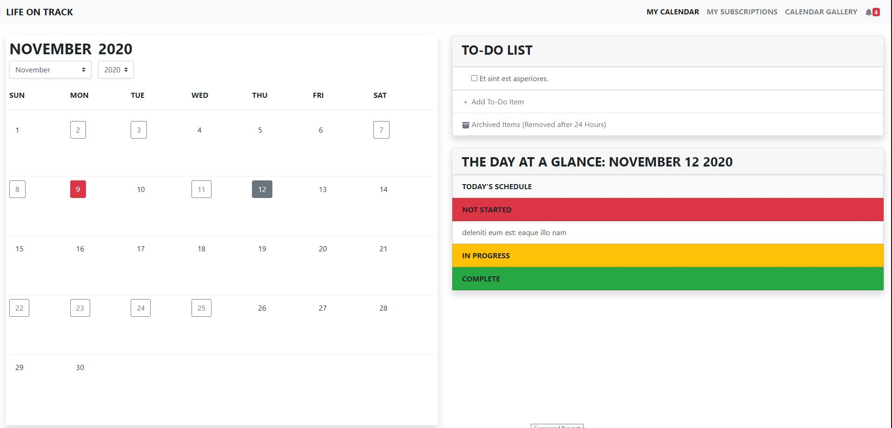

<h1>Zeta Group: Milestone 2</h1>
 
<h2>Contributions</h2>

Britney Bourassa: Personal Cal implementation, login & sign up, api functionality 

Meghan Arnold: Subscriptions page, calendar and item creation, api functionailty

Sara Whitlock: Api stubs, api functionality, faker stubs

 
<h2>Deployment</h2>

To access our hosted application, go to: https://life-on-track.herokuapp.com/

To login, we have a dummy account that you can use: Username: LifeOnTrack, Password: password (these credentials are case sensitive)

 

<h2>API Endpoints</h2>

<ul style="margin-top:0;margin-bottom:0;">
    <li>
        
/api/login

        <ul>
            <li>
                
POST: Handles user login. The request data should contain all the information needed to verify (email, password).

            </li>
        </ul>
    </li>
    <li>
        
/api/users

        <ul>
            <li>
                
GET: Returns all the users.

            </li>
            <li>
                
POST: Handles user registration. Creates a new user from the request data and adds it to the database. The request data should contain all the information needed to create a new user (first name, last name, email, username, password).

            </li>
        </ul>
    </li>
    <li>
        
/api/users/{user_id}

        <ul>
            <li>
                
GET: Returns the specified user.

            </li>
            <li>
                
DELETE: Deletes the specified user.

            </li>
        </ul>
    </li>
    <li>
        
/api/users/{user_id}/todos

        <ul>
            <li>
                
GET: Returns the user&apos;s todo list, including any archived items.

            </li>
            <li>
                
POST: Creates a new todo item for the specified user. The request body should contain the string that the user wants to make into a todo item.

            </li>
        </ul>
    </li>
    <li>
        
/api/users/{user_id}/todos/{todo_id}

        <ul>
            <li>
                
GET: Returns the specified todo item.

            </li>
            <li>
                
PUT: Edits the specified todo item. The request body should contain the item properties to be modified.

            </li>
            <li>
                
DELETE: Deletes the specified todo item.

            </li>
        </ul>
    </li>
    <li>
        
/api/users/{user_id}/subscriptions

        <ul>
            <li>
                
GET: Returns all the user&apos;s subscriptions.

            </li>
            <li>
                
POST: Create a new subscription for the user. This allows a user to subscribe to a calendar. The request data should contain the ID of the calendar that the user wants to subscribe to.

            </li>
        </ul>
    </li>
    <li>
        
/api/users/{user_id}/subscriptions/calendars

        <ul>
            <li>
                
GET: Returns all the user&apos;s subscribed calendars, including ones they created. This does not include the user&apos;s personal calendar.

            </li>
        </ul>
    </li>
    <li>
        
/api/users/{user_id}/subscriptions/calendars/items

        <ul>
            <li>
                
GET: Returns all the user&apos;s subscribed calendars as a list of objects. Each object contains a calendar ID, name, owner ID, and a list of items in that calendar.

            </li>
            <li>
                
Example output&nbsp;(using the fake data for User 3)

            </li>
        </ul>
    </li>
    <li>
        
/api/users/{user_id}/subscriptions/{sub_id}

        <ul>
            <li>
                
GET: Returns the specified subscription.

            </li>
            <li>
                
DELETE: Deletes the specified subscription. Allows a user to unsubscribe from a calendar.

            </li>
        </ul>
    </li>
    <li>
        
/api/users/{user_id}/calendar/pull

        <ul>
            <li>
                
PUT: Updates the user&apos;s personal calendar to include the items that the user wants to add from their subscriptions. The request data should contain (???).

            </li>
        </ul>
    </li>
    <li>
        
/api/calendars

        <ul>
            <li>
                
GET: Returns all the calendars in the database.

            </li>
            <li>
                
POST: Creates a new calendar and adds it to the database. The request data should contain all the information needed to create a new calendar.

            </li>
        </ul>
    </li>
    <li >
        
/api/calendars/ours

        <ul>
            <li>
                
GET: Returns all the premade calendars offered by the site.

            </li>
        </ul>
    </li>
    <li>
        
/api/calendars/{cal_id}

        <ul>
            <li>
                
GET: Returns the calendar specified by the ID.

            </li>
            <li>
                
PUT: Updates the specified calendar. The request data should contain the calendar properties to be modified. (probably only the name can be changed?)

            </li>
            <li>
                
DELETE: Deletes the specified calendar.

            </li>
        </ul>
    </li>
    <li>
        
/api/calendars/{cal_id}/subscriptions

        <ul>
            <li>
                
GET: Returns all the subscriptions that involve the specified calendar.

            </li>
        </ul>
    </li>
    <li>
        
/api/calendars/{cal_id}/subscriptions/users

        <ul>
            <li>
                
GET: Returns all the users that subscribe to the specified calendar.

            </li>
        </ul>
    </li>
    <li>
        
/api/calendars/{cal_id}/items

        <ul>
            <li>
                
GET: Returns all the items in the specified calendar.

            </li>
            <li>
                
POST: Creates a new item and adds it to the specified calendar. The request data should contain all the information needed to create a new item.

            </li>
        </ul>
    </li>
    <li>
        
/api/calendars/{cal_id}/items/{item_id}

        <ul>
            <li>
                
GET: Returns the specified item.

            </li>
            <li>
                
PUT: Updates the specified item. The request data should contain the item properties to be modified.&nbsp;**Right now, it will take all item data, changed or unchanged. If we have time, will adjust subscriptions commitChanges to only send changed data

            </li>
            <li>
                
DELETE: Deletes the specified item.

            </li>
        </ul>
    </li>
    <li >
        
/api/calendars/{cal_id}/items?year={year}&amp;month={month}

        <ul>
            <li>
                
GET: Returns all the items in the calendar that occur within the given month. Includes any events that start or end in the month.

            </li>
        </ul>
    </li>
    <li>
        
/api/calendars/{cal_id}/items?year={year}&amp;month={month}&amp;day={day}

        <ul>
            <li>
                
GET: Returns all the items in the calendar that occur on the given day.

            </li>
        </ul>
    </li>
    <li>
        
/api/subscriptions

        <ul>
            <li>
                
GET: Returns all the subscriptions in the database.

            </li>
        </ul>
    </li>
    <li>
        
/api/todos

        <ul>
            <li>
                
GET: Returns all the todo items in the database.

            </li>
        </ul>
    </li>
    <li >
        
/api/items

        <ul>
            <li>
                
GET: Returns all the items in the database

            </li>
        </ul>
    </li>
</ul>

  

<h2>Front-End Information</h2>

Our HTML and CSS setup are the same as that present in Milestone 1. Below are examples of how we have implemented each of the Create, Read, Update, Delete operations.
<h4>Example for Create: Adding an Item to Your To-Do List</h4>

The below screenshots show the setup for adding a to-do item to your to-do list. The updated information appears properly on the to-do list after adding. However, since there is no real database yet, the post for this runs successfully, the information can be seen as logged as below. With the implementation of the database, this will be added to the database.

<h4>Example for Read: Getting the Information to Build Your Personal Calendar</h4>

The personal calendar is created based on the knowledge of whether or not you have items on a particular day - these days (minus the current day which is always red and is the default "Day at a Glance" setting) are outlined to indicate to the user there are items on that day. Clicking on a day successfully shows events under the schedule portion, and successfully shows the items by status as shown below.

<h4>Example for Update: Updating your personal calendar</h4>

The user will be able to choose whether to update their personal calendar based on updates to the calendar they are subscribed to. The user will receive a notification that a their subscription has been updated. From there, they can view the item and choose to update it within their personal calendar. They are also able to choose to add all action or event items to their personal calendar from a subscription. Further, an administrator can update their existing items. As you can see n the images below, the administrator edits the item within the standard item creation pane. They are then asked to confirm that they would like to save changes and to write a message for subscribers to recieve in a notification.

<h4>Example for Delete: </h4>

The user is also able to choose to delete from their calendar. The administrator of the calendar has the ability to delete items from the calendar as wel as to delete the calendar in its entirety. As with other aspects, the backend is only partially implemented. However, the basic functionality of the deletion exists. Additionally, when the delete button is clicked, the page will alert the user that it is a permenant action. Due to constraints, this currently comes up as an alert. In the future, this will be a modal that gives the user the option to confirm or cancel.

 

